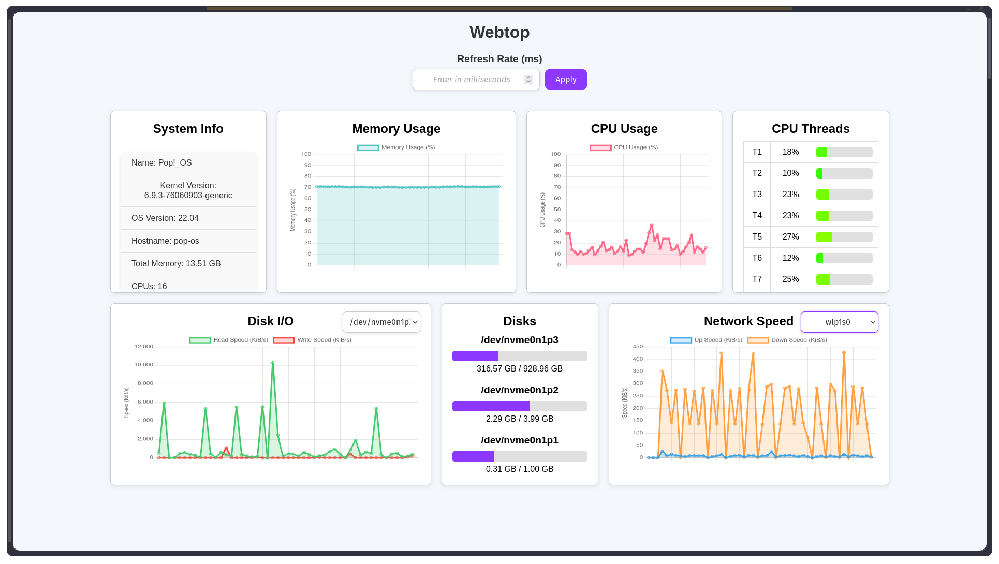
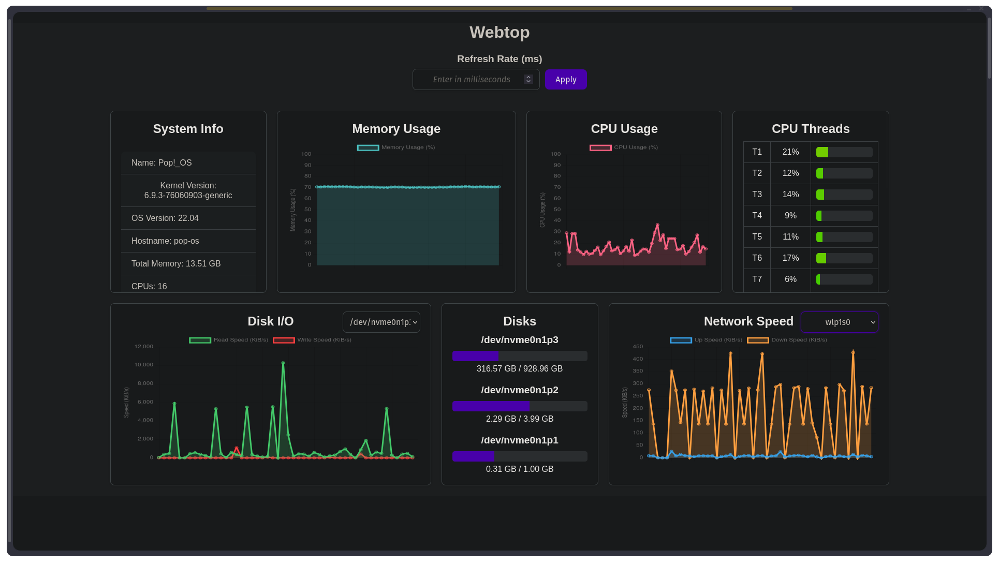

# Webtop
Easy hardware monitoring for servers.

## Default:

## Darkreader:

## Features
- [x] memory usage graph
- [x] cpu usage graph
- [x] individual thread usage display
- [x] network speed graph
- [x] disk space display
- [x] disk I/O speed graph
- [x] general system info display
- [x] variable refresh rate
- [x] draggable and resizeable components

## Future plans
- [ ] individual services for every component
- [ ] dynamic display of components where user can select which items they want to see on their dashboard
- [ ] docker container monitoring and managing
- [ ] full lab dashboard with links to all webservices running on the server

Do you have any suggestions on what else Webtop could be monitoring, do let me know by opening an issue!
